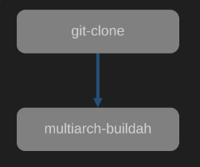
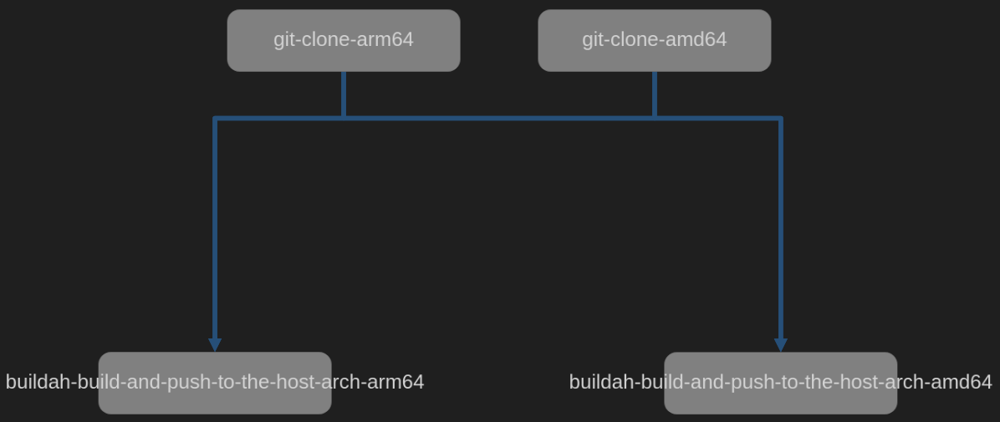

# Multi-architecture pipeline with OpenShift pipeline

> Le cluster OpensShift utilisé contient des workers en arm64 et amd64, dans la première solution on utilise que les workers en amd64 avec une émulation QEMU opéré via un daemonset.
>
> Le fichier [nodeselector.yaml](./solution1/nodeselector.yaml) contient la directive qui permet d'aiguiller vers une node dans une architecture spécifique.

## Contraintes

- [x] On utilise buildah pour construire nos images.
- [x] Notre cluster à un worker amd64 et un arm64 au minimum.
- [x] On contrôle le placement des nodes en utilisant les règles de "node affinity".


## Solution 1: avec l'émulation QEMU.


### Nécessite d'avoir les privilèges suffisants.

Vérifier au préalable les contraintes de sécurité de votre cluster:

```
oc get scc
```

Vous pouvez créer votre propre compte de service et lui appliquer les bonnes contraintes de sécurités pour faire une élévation de privilège:

```
oc adm policy add-scc-to-user privileged -z  <<your_sa>> -n <<your_project>>
```

### Créer les ressources

```
oc apply -f ./solution1/tasks && \    
oc apply -f ./solution1/daemonset.yaml && \    
oc apply -f ./solution1/pvc.yaml && \    
oc apply -f ./solution1/pipeline.yaml    
```

_Détail du pipeline de la solution 1:_




### Lancer le pipeline avec les paramètres par défault.

```
tkn pipeline start buildah-multiarch \
    --namespace=test \
    --pod-template [nodeselector.yaml](./solution1/nodeselector.yaml) \
    --serviceaccount=pipeline \
    --use-param-defaults \
    --workspace name=scratch,claimName=source-pvc,subPath=src \
    --showlog
```

### Lancer le pipeline avec des paramètres spécifiques.

```
tkn pipeline start buildah-multiarch \
    --namespace=test \
    --pod-template nodeselector.yaml \
    --serviceaccount=pipeline \
    --param buildahPlatforms=linux/x86_64,linux/arm64/v8 \
    --param gitRepositoryURL=https://github.com/smartinus44/buildah-multiarchitecture-build.git \
    --param outputContainerImage=quay.io/rh_ee_symartin/multiarch_test/code-with-quarkus \
    --param containerfilepath=Containerfile \
    --workspace name=scratch,claimName=source-pvc,subPath=src \
    --showlog
```

## Solution 2: sans l'émulation QEMU via deux pipelines indépendants.

> Dans cette seconde solution on utilise les workers en amd64 et en arm64.
>
> WIP


```
oc apply -f ./solution2/tasks && \
oc apply -f ./solution2/pvc-arm64.yaml && \
oc apply -f ./solution2/pvc-amd64.yaml
```

_Détail du pipeline de la solution 2:_


### Lancer le pipeline avec les paramètres pour arm64.
```
tkn pipeline start multiarch-without-emulation \
    --namespace=test \
    --pod-template ./solution2/nodeselector-arm64.yaml \
    --workspace name=scratch,claimName=source-pvc-arm64 \
    --serviceaccount=pipeline \
    --use-param-defaults \
    --param platarch=linux/arm64 \
    --showlog
```

### Lancer le pipeline avec les paramètres pour amd64.
```
tkn pipeline start multiarch-without-emulation \
    --namespace=test \
    --pod-template ./solution2/nodeselector-amd64.yaml \
    --workspace name=scratch,claimName=source-pvc-amd64 \
    --serviceaccount=pipeline \
    --use-param-defaults \
    --param platarch=linux/amd64 \
    --showlog
```


## Solution 3: sans l'émulation QEMU via un pipelines paramétrable pour chacune des architectures.

```
oc apply -f ./solution3/tasks && \
oc apply -f ./solution3/pvc-arm64.yaml && \
oc apply -f ./solution3/pvc-amd64.yaml && \
oc apply -f ./solution3/pipeline.yaml    
```

_Détail du pipeline de la solution 3:_



### Lancer le pipeline avec les paramètres, exemple pour le tag 1.2.
```
tkn pipeline start multiarch-build-tag \
    --namespace=test \
    --workspace name=scratch-amd64,claimName=source-pvc-amd64 \
    --workspace name=scratch-arm64,claimName=source-pvc-arm64 \
    --serviceaccount=pipeline \
    --use-param-defaults \
    --param outputContainerTag=1.2
    --showlog
```

Il est possible de lancer la pipeline via l'interface graphique.

